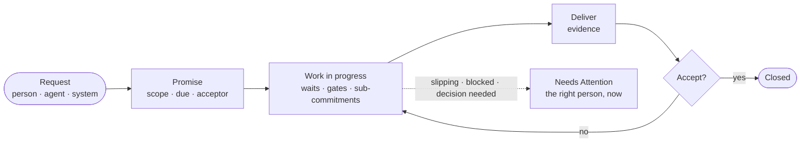
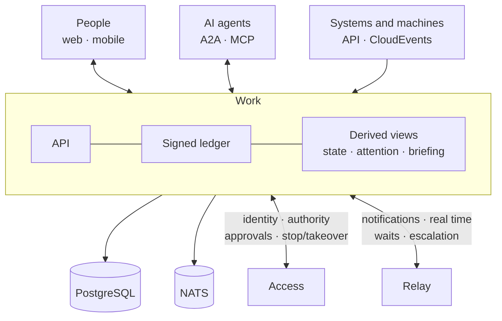

# Work

**Open-source coordination of work between people, AI agents, systems and machines.**

Work answers the questions every team and every agent fleet keeps asking: who has this, what was promised to whom, what are we waiting on, what is blocked, which decision is pending — and whose attention is needed right now. It records commitments, not just tasks, and keeps a signed history of who said what, when, and on whose behalf.

[](LICENSE)


---

## Why Work

Task boards track cards in columns. Real work is made of promises: someone asks, someone commits, someone delivers, and someone accepts. When a promise slips, the people who depend on it should know — before the deadline, not after.

AI agents make this harder. An agent can take work, run for hours on another machine, get stuck on a question, or need a human to approve a step. Work gives humans and agents one shared record of commitments, waits and decisions, and puts the few things that actually need a person in front of that person.

Work is not designed around any profession or tool. Software teams, operations, support, finance and robot fleets use the same core; domain vocabulary is added as Practices on top.

## Features

**Commitments, not just tasks**
- Request → promise → deliver → accept, with counter-offers, conditional promises and four-eyes acceptance
- Delegation keeps the original promise visible; sub-commitments roll risk up the chain
- Budgets, SLAs, periodic updates, implicit acceptance windows and amendments
- Every change is a typed, signed record; state is derived from records, never edited by hand

**Attention**
- Needs Attention: only items that need *you*, why now, and what happens if you wait
- Briefing: what meaningfully changed while you were away — and then it ends
- Addressed waits: every "waiting on…" names who or what it waits for
- Escalation policies delivered through Relay; muting never stops the clock

**People and AI agents together**
- Give work to an agent fleet across machines, watch progress live, and step in when needed
- Accountable owner, single driver and control hand-off; stop requests and takeover through Access Executor
- Gates for decisions, delivery acceptance and plan approval; approvals are never inferred from a chat message
- Agent output is evidence, never authority; agent rationale is visible to the people who own the work

**Trust and history**
- Append-only, signed ledger with checkpoints and independent witnesses
- Evidence and provenance on every claim; offline verification of any record
- Cross-organization work where the origin owns its records, with selective disclosure and receipts
- No physical deletes; personal data erasure by crypto-shredding

**Open and extensible**
- Practices: domain templates, record subtypes and rules — authored in a visual editor, as YAML, or with an SDK
- REST API, CloudEvents, signed webhooks, A2A and MCP
- Import from Jira, Linear or CSV
- Web app and mobile app with an offline queue for signed statements

## How it works





Work records and derives; it does not execute. Identity, authority and the actual stopping of an agent live in Access; delivery, real-time streams, waits and escalation timing live in Relay. The three are deployed together as one system.

## Getting started

Work is in active design; implementation has not started yet. When the first build lands, local development will be one command:

```sh
git clone https://github.com/e-suiss/work.git
cd work
just dev    # PostgreSQL, NATS, local Access and Relay
just test
```

## Tech stack

Rust (server and a `no_std` core shared by server, web and mobile through WebAssembly and native bindings), PostgreSQL, NATS JetStream, React and React Native.

## Related projects

- **[Access](https://github.com/e-suiss/access)** — identity and authority. Work uses Access for sign-in, permissions, approvals and stopping agents.
- **[Relay](https://github.com/e-suiss/relay)** — notification, messaging and event delivery. Work uses Relay to reach people and agents, wait for answers and escalate.

Access, Relay and Work are parts of one system and are always deployed together.

## Contributing

Contributions are welcome. Read [CONTRIBUTING.md](CONTRIBUTING.md) before opening a pull request, and report vulnerabilities privately as described in [SECURITY.md](SECURITY.md).

## License

Work is open source under the [Apache License 2.0](LICENSE). Self-hosted and Suiss-hosted Work run the same code; no feature is cloud-only.
